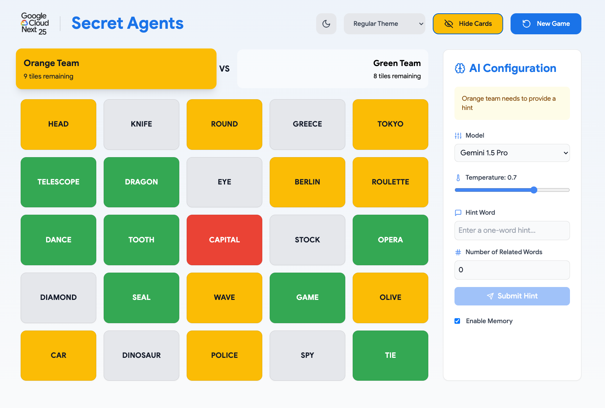
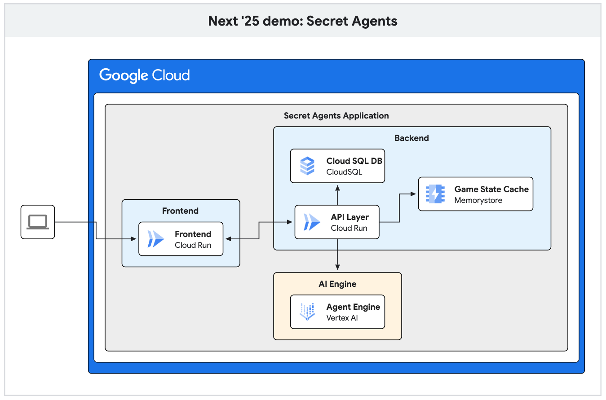

# :game_die: :robot: Secret Agents (Next 2025)



Team up with an AI agent to compete at this popular board game! Discover how
Vertex AI, Memorystore and Cloud SQL with different Gemini models and tools can
ultimately lead to victory!

## Table of contents

- [Architecture](#architecture)
- [Deployment](#deployment)
  - [Backend](#backend)
  - [Frontend](#frontend)
- [Future work](#future-work)

## Architecture

Secret Agents used the following Google Cloud Platform resources:

- **Cloud SQL**: Used to load initial game data (words) and to save game history
  upon completion of a game.
- **Memorystore**: Game state is cached in Memorystore for ultra-low latency data
  retrieval.
- **Vertex AI Agent Engine**: LangGraph AI agents are deployed with Agent Engine,
  abstracting away the complexity of orchestration with the full capabalities of
  Vertex AI models and function (tool) calling.
- **Cloud Run**: Cloud Run is used to deploy and host both the frontend (UI) and
  backend (API layer) of Secret Agents.



## Deployment

The following steps assume that a Cloud SQL instance (using Public IP) and
Memorystore instance (using Private Service Connect) already exist.

Terraform support is coming soon.

Make sure your environment is using the proper Google Cloud Project via:

```sh
gcloud config set project <PROJECT_ID>
```

Save this as an environment variable for future steps:

```sh
export PROJECT_ID=$(gcloud config get project)
```

### Backend

```sh
cd backend
```

To build the backend container:

```sh
gcloud builds submit --region=us-central1 --tag us-central1-docker.pkg.dev/$PROJECT_ID/backend-image/backend:latest
```

To deploy the backend Cloud Run service:

```sh
gcloud run deploy backend-service \
    --image us-central1-docker.pkg.dev/$PROJECT_ID/backend-image/backend:latest \
    --service-account backend-sa \
    --update-secrets INSTANCE_CONNECTION_NAME=INSTANCE_CONNECTION_NAME:latest,DB_USER=DB_USER:latest,DB_PASSWORD=DB_PASSWORD:latest,DB_NAME=DB_NAME:latest,REDISHOST=REDISHOST:latest,REDISPORT=REDISPORT:latest,MERRIAM_WEBSTER_API_KEY=MERRIAM_WEBSTER_API_KEY:latest \
    --network=default \
    --subnet=default \
    --vpc-egress=private-ranges-only \
    --allow-unauthenticated
```

### Frontend

```sh
cd frontend
```

To build the frontend container:

```sh
gcloud builds submit --region=us-central1 --tag us-central1-docker.pkg.dev/$PROJECT_ID/frontend-image/frontend:latest
```

To deploy the frontend Cloud Run service:

```sh
gcloud run deploy frontend-service \
    --image us-central1-docker.pkg.dev/$PROJECT_ID/frontend-image/frontend:latest \
    --service-account frontend-sa \
    --allow-unauthenticated
```

## Future work

- [ ] Cloud SQL with PSC endpoint
- [ ] Terraform Support
